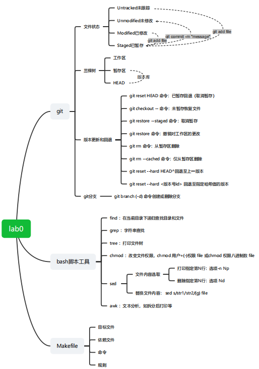
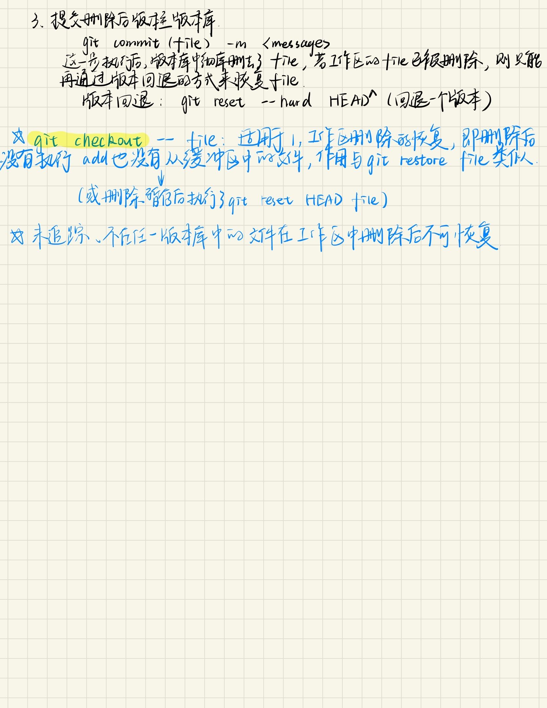

## OS Lab0 实验报告
### 一、思考题（按指导书中顺序）
#### Thinking 0.1
Untracked.txt和Staged.txt内容分别如下：
>Untracked.txt:
```txt
位于分支 master
未跟踪的文件:
  （使用 "git add <文件>..." 以包含要提交的内容）
        README.txt
        Untracked.txt

```
>Staged.txt:
```txt
位于分支 master
要提交的变更：
  （使用 "git restore --staged <文件>..." 以取消暂存）
        新文件：   README.txt

未跟踪的文件:
  （使用 "git add <文件>..." 以包含要提交的内容）
        Staged.txt
        Untracked.txt

```
两次README.txt分别处在工作区（仅在工作区）和暂存区。
>Modified.txt:
```txt
位于分支 master
尚未暂存以备提交的变更：
  （使用 "git add <文件>..." 更新要提交的内容）
  （使用 "git restore <文件>..." 丢弃工作区的改动）
        修改：     README.txt

未跟踪的文件:
  （使用 "git add <文件>..." 以包含要提交的内容）
        Modified.txt
        Staged.txt
        Untracked.txt

```
不同。之前是“未跟踪的文件”，已跟踪且修改后是“修改后的文件”。

#### Thinking 0.2
add the file对应
```bash
git add filename
```
stage the file对应
```bash
git add filename
```
commit对应
```bash
git commit [filename] -m "comments"
```
#### Thinking 0.3
>**1.代码文件 print.c 被错误删除时，应当使用什么命令将其恢复？**

*situation 1*:当print.c文件删除后还未暂存（没有执行git add操作）时，使用命令：
```bash
git checkout -- print.c 
```
或
```bash
git restore print.c
```

*situation 2*:当print.c文件删除后已暂存（删除后进行了git add），可以先使用git restore --staged或git reset HEAD print.c 取消暂存，再git checkout -- print.c或git restore
```bash
git reset HEAD print.c
git checkout -- print.c
```
*situation 3*:当print.c删除后文件已提交（即未修改），使用版本回退：
```bash
git reset --hard HEAD^ #回退到上一个版本
```
或使用git log命令查看提交的版本号进行回退：
```bash
git log
git reset --hard <commit id>
```
>**2.代码文件 print.c 被错误删除后，执行了 git rm print.c 命令，此时应当使用什么命令将其恢复？**

首先取消暂存，然后恢复文件(相当于rm后进行了add操作)：
```bash
git reset HEAD print.c
git checkout -- print.c
```

>**3.无关文件 hello.txt 已经被添加到暂存区时，如何在不删除此文件的前提下将其移出暂存区？**

使用命令：
```bash
git rm --cached hello.txt
```


#### Thinking 0.5
echo first执行结果：
```bash
first
```
全部执行后output.txt内容：
```txt
third
forth
```
#### Thinking 0.6
>command文件内容：
```shell
touch test
echo 'echo Shell Start...' > test
echo 'echo set a = 1' >> test
echo 'a=1' >> test
echo 'echo set b = 2' >> test
echo 'b=2' >> test
echo 'echo set c = a+b' >> test
echo 'c=$[$a+$b]' >> test
echo 'echo c = $c' >> test
echo 'echo save c to ./file1' >> test
echo 'echo $c>file1' >> test
echo 'echo save b to ./file2' >> test
echo 'echo $b>file2' >> test
echo 'echo save a to ./file3' >>test
echo 'echo $a>file3' >> test
echo 'echo save file1 file2 file3 to file4' >> test
echo 'cat file1>file4' >> test
echo 'cat file2>>file4' >> test
echo 'cat file3>>file4' >> test
echo 'echo save file4 to ./result' >> test
echo 'cat file4>>result' >> test
```
>result文件内容：
```bash
Shell Start...
set a = 1
set b = 2
set c = a+b
c = 3
save c to ./file1
save b to ./file2
save a to ./file3
save file1 file2 file3 to file4
save file4 to ./result
3
2
1
```
解释：
test文件内容如下。
```bash
echo Shell Start...
echo set a = 1
a=1
echo set b = 2
b=2
echo set c = a+b
c=$[$a+$b]
echo c = $c
echo save c to ./file1
echo $c>file1
echo save b to ./file2
echo $b>file2
echo save a to ./file3
echo $a>file3
echo save file1 file2 file3 to file4
cat file1>file4
cat file2>>file4
cat file3>>file4
echo save file4 to ./result
cat file4>>result
```
test作为批处理文件运行后（结果重定向至result），以echo命令开头的行若没有重定向直接输出到result文件，三个有重定向的语句分别将c、b、a的值输出到文件file1、file2、file3中，最后分别将file1、2、3追加重定向到file4，并将file4内容追加到了result文件末尾。
>echo echo Shell Start和echo \`echo Shell Start`的区别
```bash
echo echo Shell Start #直接打印echo后的整个字符串
echo `echo Shell Start` #命令替换符，用其标准输出结果Shell Start替换了命令本身
```
输出区别：二者分别输出：
```txt
echo Shell Start
Shell Start
```
>echo echo \$c>file1和echo \`echo $3>file1`

同理，前者打印对象是"echo \$c",重定向至file1，此时重定向的命令对象是第一个echo，第二个echo只是普通字符串。后者命令替换符中打印对象是"\$c",重定向至file1，此时重定向的命令对象是``里面的echo。
输出区别：前者没有标准输出，后者标准输出一个换行符，file1文件内容分别为：
```txt
echo 3
3
```

### 二、难点分析
#### 思维导图
本次实验涉及知识的思维导图：

#### 难点总结
难点1. exercise0.4中Makefile的编写：涉及目标文件和依赖文件所处目录，还涉及到了库文件的建立。
难点2. Git工具的使用和理解。缓冲区的作用和涉及的具体命令，以及如何根据这些抽象的概念建立合适的理解，是较难的一个点。

### 三、实验体会
除了make工具、shell脚本等内容，本次实验让我感受最深的就是体会到了git工具的强大，初步学会了git工具的使用方式，并整理了关于git基本操作的理解和用法：
.jpg)
